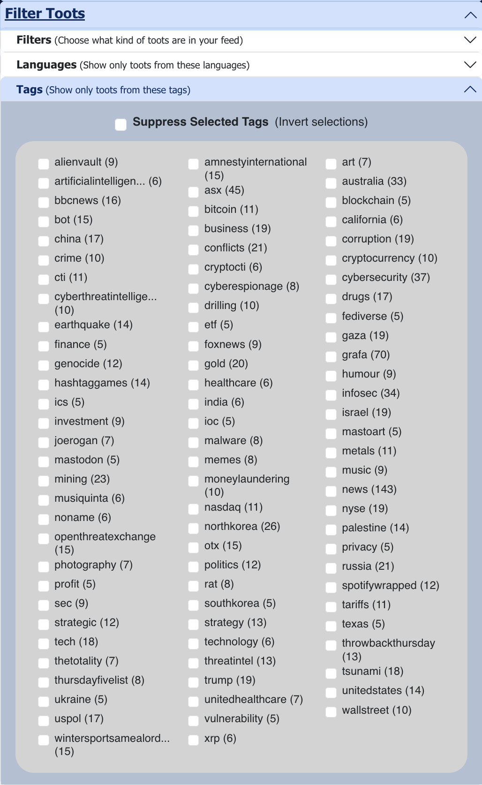

# FediAlgo: A Configurable Mastodon Timeline Algorithm

This repo contains a simple demo React application (a website, basically - one that if you follow the instructions in this document will be served to your usual browser from a webserver running on your local machine) for the (almost) pure javascript [`fedialgo`](https://github.com/michelcrypt4d4mus/fedialgo) package, a customizable algorithm for the federated social media platform [Mastodon](https://joinmastodon.org/) that can free you from the tyranny of Mastodon's reverse chronological order timeline.

Each incoming toot in your recent timeline will be scored based on a variety of factors and resorted top to bottom based on what toots have the highest scores instead of just reverse chronological order. You can adjust in a very fine grained way how much weight you want to give to each of those factors in determining each toot's scores.

    

**None of your data ever leaves your browser.** All computations and reorderings are done in client side javascript.

Both this repo and the `fedialgo` package linked above were forked from [pkreissel's original implementations](https://github.com/pkreissel/fedialgo).

### Demo Video

# Installation
### Prerequisites
* [`node.js`](https://nodejs.org/):
   * On Linux use `apt`, `yum`, or your favorite package manager. For example here's [guide on how to install `node.js` on Ubuntu linux](https://www.digitalocean.com/community/tutorials/how-to-install-node-js-on-ubuntu-20-04).
   * On macOS you can install `node.js` with [Homebrew](https://brew.sh/) by running `brew install node`.
* `git`
   * Hopefully you have `git` installed already but if you're on a recent version of macOS you may need to use Homebrew: `brew install git`

### Quick Start
There's [a script](./quick_install.sh) in this repo that will do all the steps for you if you're into that kind of thing, otherwise:

1. `git clone https://github.com/michelcrypt4d4mus/fedialgo_demo_app_foryoufeed`
1. `cd fedialgo_demo_app_foryoufeed`
1. `npm install` (you can ignore the various warnings)
1. `npm run start`
   * It should automatically change focus to your default browser and prompt you to login to Mastodon but if that doesn't happen you can point your browser at [`http://localhost:3000/`](http://localhost:3000/).
1. Specify the Mastodon server your account lives on and click "Login". If you're already logged in with that browser you won't have to enter a password.
   

     
   

1. After you've logged in to your Mastodon server (or if you're logged in in that browser) your browser will request that you give `fedialgo` permission to access your Mastodon account. If you don't accept this app will not work.
   

     
   

1. Wait for the magic. The first time you load the page it can take a while because it has to collect a bunch of federated data: things like trending posts on other servers, toots from accounts you follow, your notifications, and your recent Mastodon history so it can tell which users you interact with the most (which is by default an important part of the algorithm).
1. Have fun.
1. Profit.

# Usage
## Setting Weights
Once the initial load is complete you can adjust the way the algorithm weights various aspects of a toot when it decides what should be at or near the top of your feed. Hopefully these are self explanatory:

    

One thing that's kind of a gotcha is the way the `topPosts - Favor posts that are trending in the Fediverse` slider works. Because trending posts often have tons of engagement in the form of replies, favorites, and retoots they can easily drown out the toots from people you are actually following. As a result the impact of this slider gets increasingly drastic _but only if the value is below 1.0_. At 1.0 and above it behaves like all the other weighting sliders.

## Filtering
You can filter based on hashtag, source (accounts you follow, hashtags you follow, various kinds of trending toots), language, and application.

    
    

## Investigating A Toot's Score
Clicking the ⚖️ in the GUI will bring up a popup that will show you the gorey details of how a toot measured up.

    

Here's an example of the elements that go into scoring a toot:

    

## Retooting And Favoriting
* You can retoot and favorite other people's toots through this app's web interface.
* Clicking the reply icon will take you to the standard Mastodon web app view of the toot you want to reply to on your home server.
* Clicking the timestamp in the top right corner will take you to the toot on that tooter's home server (you'll only be able to reply if that's also your home server).

## Shutdown
`Ctrl-C` in the terminal window you launched the `node.js` server in (with `npm run start`) will kill the app.

# Known Issues
* If you get an error about `GenerateSW() was called more than once` or whatever just ignore it.
* Sometimes (always?) when starting the app after the first time you will find your Mastodon login has expired in which case you will be kicked back to the login screen for reauthorization.
* Infinite scroll isn't _really_ infinite (yet). If you scroll far enough you will run out of toots to peruse.
* Whether or not a toot that matches one of your preconfigured (via web app or whatever) "hide these toots" filter rules actually ends up getting hidden depends on the server version of the user posting the toot that should be hidden. Put another way: sometimes toots escape your preconfigured filters.

### Troubleshooting
Most (all?) browsers will allow you to clear all the "site data" (cookies and cache) for a single site. If you run into an issue try doing that and then reloading the app at `https://localhost:3000`.
* [How to do that in Chrome](https://support.google.com/chrome/thread/16531954/clear-cache-for-specific-website-in-google-chrome?hl=en).

# Contributing
You can install the local `fedialgo` package by running `npm link`  in the `fedialgo` project dir and then`npm link fedialgo` in this project's dir _or_ you can do that kind of thing manually by running `npm install path/to/local/fedialgo` in this repo's dir but either way in order to pick up any code changes from `fedialgo` you will have to run `npm run build` in the `fedialgo` package dir. (TODO: why?)

Assuming you check both `fedialgo` and this repo out to the same directory there's a helper script to link the local repo in [`link_local_fedialgo.sh`](./link_local_fedialgo.sh).

#### Code Notes
* There's tons of info on how the scoring and weighting of toots is being done in your browser's javascript debug console logs.
* The interesting stuff that actually handles the feed is in the [`Feed.tsx`](src/pages/Feed.tsx) file.
* The bird UI of this app is based on the following repo: https://github.com/ronilaukkarinen/mastodon-bird-ui
